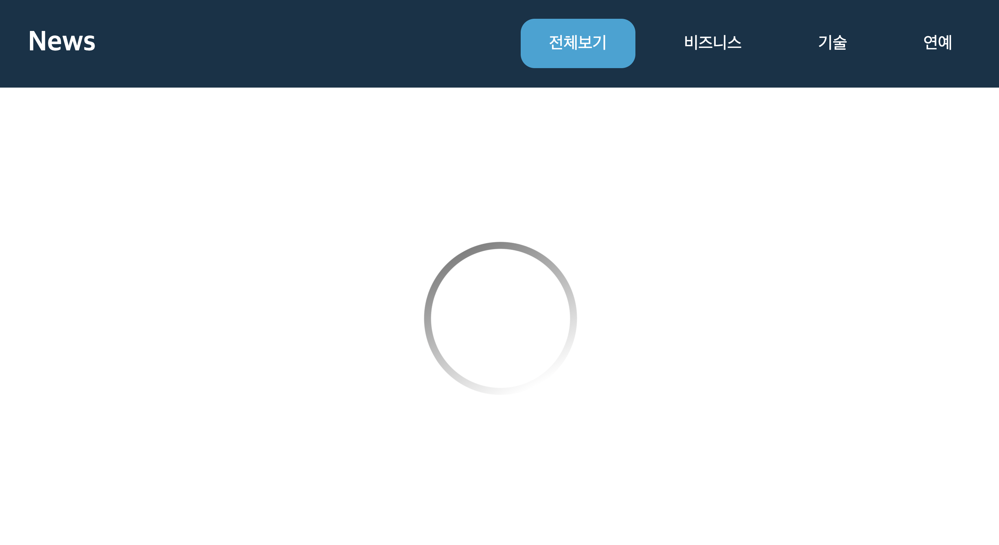
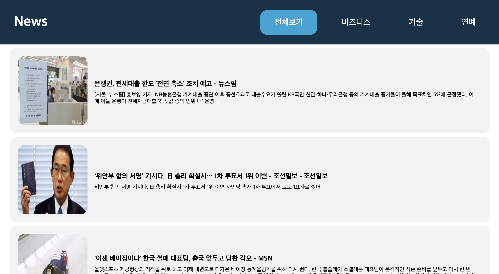
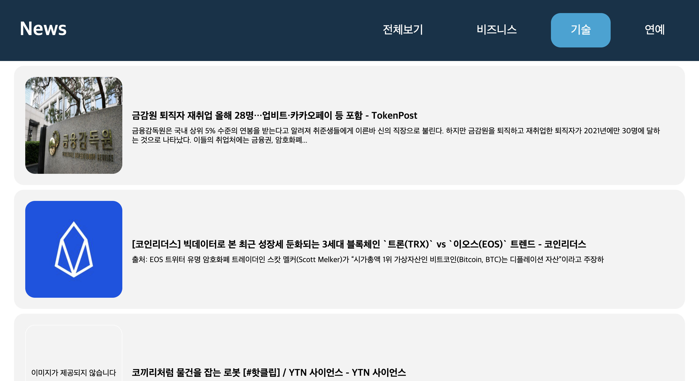

# NewsViewer

> 함수형 컴포넌트를 이용한 NewsViewer 개발

## API 요청이 완료되지 않았을의 로딩 화면



## 최초의 전체 기사가 불러와지는 화면

> animation css를 이용해 회전하는 로딩화면 구현



## 특정 기사에 마우스 호버시 화면

> Hover시 해당 기사로 이동할 수 있는 버튼이 보여진다.


## 네비게이션으로 카테고리를 선택한 뒤의 화면



<br> <br>

## 실행 방법

```
npm install package.json

webpack ./index.js
```
