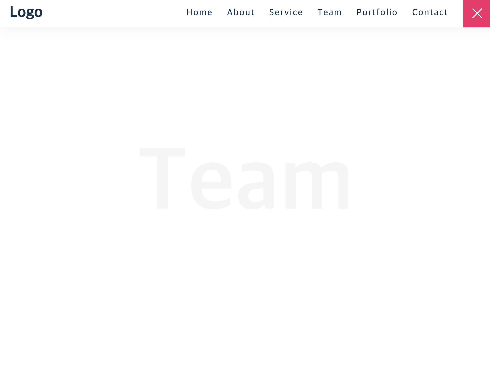
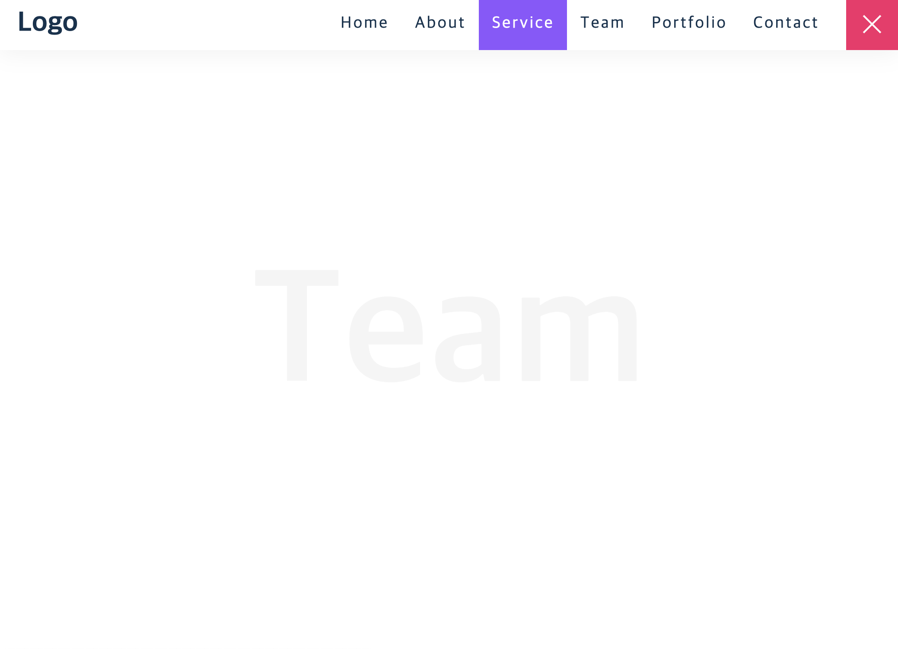
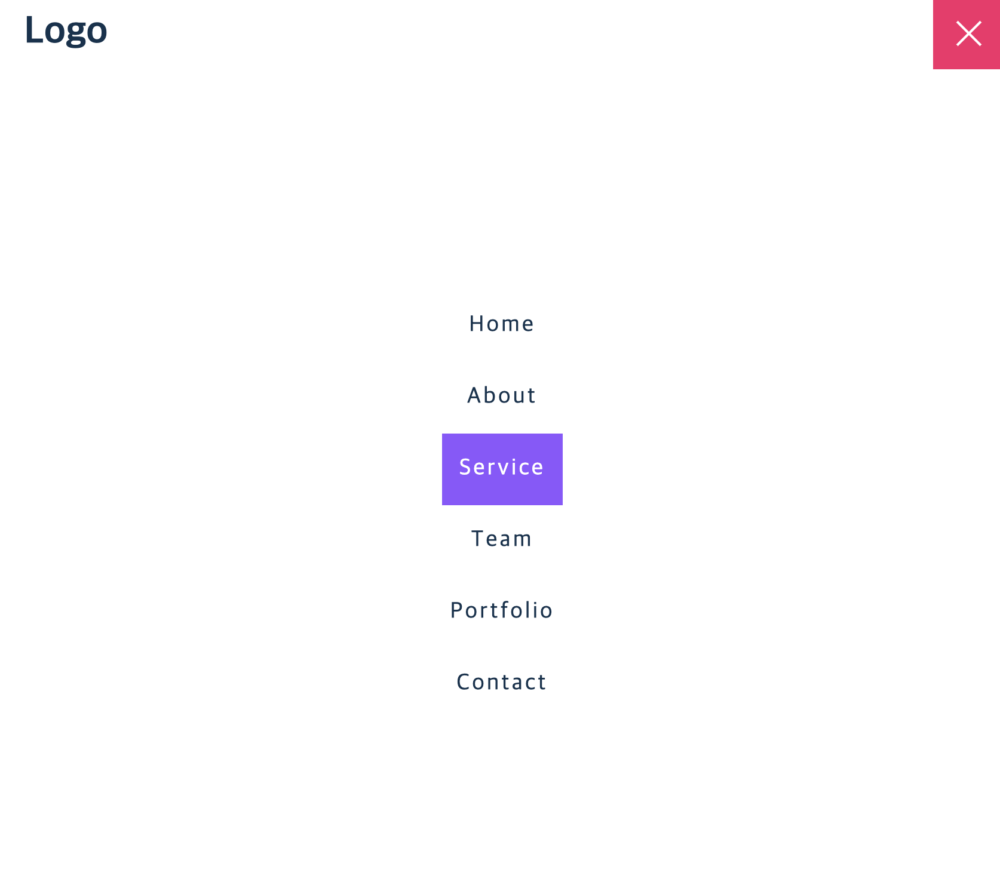

# Responsive Navigation Bar

> - Javascript onclick을 이용해 active class toggle
> - active class 여부에 따라 스타일 반영
> - media를 이용해 기기가 작아지는 것에 맞춰 네비게이션 스타일 바인딩

### 기본 상태

### 기본 네비게이션 상태 + hover

## 반응형 네비게이션 상태 + hover

